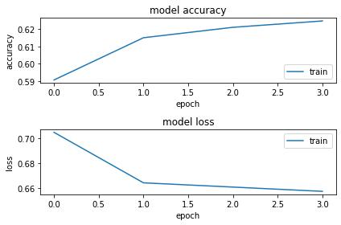

```python

```


```python
from tensorflow import keras 
from tensorflow import keras as ks
import numpy as np
import pandas as pd
import sklearn as sk
import time
from keras.datasets import mnist
from keras.models import Sequential, load_model
from keras.layers import Dense, Dropout, Flatten, BatchNormalization
from keras import optimizers

from keras import backend as K
from keras import regularizers
from keras import initializers
from tensorflow.keras import layers
from matplotlib import pyplot as plt

from tensorflow.keras.models import Sequential
from tensorflow.keras.layers import Dense
from tensorflow.keras.utils import to_categorical
```


```python
# split the data to train and test,
# make sure convert pandas to numpy
from sklearn.model_selection import train_test_split
df = pd.read_csv("/content/drive/MyDrive/4050_HW04/train_AFTER_EDA.csv")
df=df.drop(['StudentID','cohort','overall_income'], axis=1)
## pre store the name, will be use later
dfName = list(df.columns)
# print(df.columns)
df = df.to_numpy()

```


```python
from sklearn.model_selection import StratifiedShuffleSplit
# stratified to split train and test
split = StratifiedShuffleSplit(n_splits = 1, test_size = 0.2, random_state = 123)
for train_index, test_index in split.split(df, df[:, -1]): 
  train_set = df[train_index, :]
  test_set = df[test_index, :]
# print(len(train_set))
# print(len(test_set))
```


```python
# set hyper-parameters
batch_size = 128
num_classes = 2
epochs = 5
```


```python
# 重新设回dataframe，但是缺失column name
train_set = pd.DataFrame(train_set)
test_set = pd.DataFrame(test_set)

# 重新赋值column name, 用 dfName
train_set.columns = dfName
test_set.columns = dfName

## One hot encoding since "unsupported object type int"
for features in train_set.columns: 
  if train_set[features].dtype == "object": 
    train_set[features] = pd.Categorical(train_set[features]).codes

for features in test_set.columns: 
  if test_set[features].dtype == "object": 
    test_set[features] = pd.Categorical(test_set[features]).codes

x_train=train_set.drop(['Dropout'], axis=1)
x_test=test_set.drop(['Dropout'], axis=1)
## try
# x_train = train_set
# x_test = test_set

y_train=train_set['Dropout']
y_test=test_set['Dropout']

y_train = y_train.to_numpy()
y_test = y_test.to_numpy()

print(x_train.shape)
print(x_test.shape)
print(y_train.shape)
print(y_test.shape)


```

    (9808, 28)
    (2452, 28)
    (9808,)
    (2452,)


```python
Y_train = to_categorical(y_train, num_classes)
Y_test = to_categorical(y_test, num_classes)
```

# 1. Neural network with one hidden layer, using sigmoid activation function, momentum stochastic gradient descent, and dropouts.


```python
# set hyper-parameters
batch_size = 128
num_classes = 2
epochs = 4
```


```python
## Create the network layer
## one hidden layer
model = Sequential()
model.add(Dense(58, activation = "sigmoid", input_shape = (28, )))
model.add(Dropout(0.25))
model.add(Dense(num_classes, activation = "sigmoid"))

model.summary()

## Momentum Stochastic Gradient Descent
sgd = ks.optimizers.SGD(lr = 0.01, decay = 1e-6, momentum = 0.9, nesterov = True)

## compile the model
model.compile(loss = "categorical_crossentropy", optimizer = sgd, metrics = ["accuracy"])
```

    Model: "sequential_2"
    _________________________________________________________________
     Layer (type)                Output Shape              Param #   
    =================================================================
     dense_5 (Dense)             (None, 58)                1682      
                                                                     
     dropout (Dropout)           (None, 58)                0         
                                                                     
     dense_6 (Dense)             (None, 2)                 118       
                                                                     
    =================================================================
    Total params: 1,800
    Trainable params: 1,800
    Non-trainable params: 0
    _________________________________________________________________


    /usr/local/lib/python3.8/dist-packages/keras/optimizers/optimizer_v2/gradient_descent.py:108: UserWarning: The `lr` argument is deprecated, use `learning_rate` instead.
      super(SGD, self).__init__(name, **kwargs)


```python
# x_train = x_train.to_numpy()
# x_test = x_test.to_numpy()
# y_train = y_train.to_numpy()
# y_test = y_test.to_numpy()
type(Y_train)
```


    numpy.ndarray


```python
## Fit the model on training set
start_time = time.time()
history = model.fit(x_train, Y_train, 
                    batch_size = batch_size, 
                    epochs = epochs, 
                    verbose = 1)
print("Training duration : ", time.time() - start_time)

## saving the model
model.save("/content/drive/MyDrive/4050_HW04/onehidden.h5")

```

    Epoch 1/4
    77/77 [==============================] - 1s 2ms/step - loss: 0.7048 - accuracy: 0.5906
    Epoch 2/4
    77/77 [==============================] - 0s 2ms/step - loss: 0.6641 - accuracy: 0.6150
    Epoch 3/4
    77/77 [==============================] - 0s 2ms/step - loss: 0.6606 - accuracy: 0.6210
    Epoch 4/4
    77/77 [==============================] - 0s 2ms/step - loss: 0.6572 - accuracy: 0.6247
    Training duration :  1.75050950050354


```python
## plotting the metrics
plt.subplot(2,1,1)
plt.plot(history.history['accuracy'])
plt.title('model accuracy')
plt.ylabel('accuracy')
plt.xlabel('epoch')
plt.legend(['train', 'test'], loc='lower right')

plt.subplot(2,1,2)
plt.plot(history.history['loss'])
plt.title('model loss')
plt.ylabel('loss')
plt.xlabel('epoch')
plt.legend(['train', 'test'], loc='upper right')

plt.tight_layout()
```


    

    


Measure Performance


```python
score = model.evaluate(x_test, Y_test, batch_size=3)

print("Network test score [loss, accuracy]:", score)
```

    818/818 [==============================] - 1s 1ms/step - loss: 0.6524 - accuracy: 0.6330
    Network test score [loss, accuracy]: [0.6524078845977783, 0.6329526901245117]


```python
## Create predictions on the test set
mnist_model = load_model("/content/drive/MyDrive/4050_HW04/onehidden.h5")

predicted_classes = np.argmax(mnist_model.predict(x_test), axis = 1)
print(predicted_classes.shape)
print(y_test.shape)
print(predicted_classes)

print(y_test)

```

    77/77 [==============================] - 0s 1ms/step
    (2452,)
    (2452,)
    [0 0 0 ... 0 0 0]
    [0 0 0 ... 1 1 1]


```python
## see which we predicted correctly and which not
correct_indices = np.nonzero(predicted_classes == y_test)[0]
incorrect_indices = np.nonzero(predicted_classes != y_test)[0]
# print(correct_indices)
print(len(correct_indices), " classified correctly")
print(len(incorrect_indices), " classified incorrectly")
```

    1552  classified correctly
    900  classified incorrectly


# 2.Neural network with three hidden layers, using relu activation function, Nesterov momentum stochastic gradient descent, dropouts, L2 regularization and random Gaussian weight initialization with 1/sqrt(n) standard deviation.


```python
# set hyper-parameters
batch_size = 128
num_classes = 2
epochs = 5
```


```python
## Create the network layer
## one hidden layer
import math
model = Sequential()
# 1
model.add(Dense(256, activation = "relu", input_shape = (28, ), 
                kernel_regularizer = regularizers.l2(0.001), 
                kernel_initializer=initializers.RandomNormal(mean=0, stddev = 1/math.sqrt(28))))
model.add(Dropout(0.2))
# 2
model.add(Dense(128, activation = "relu" ))
model.add(Dropout(0.25))
# 3
model.add(Dense(64, activation = "relu"))
model.add(Dropout(0.1))

model.add(Dense(num_classes, activation = "softmax"))

model.summary()

## Momentum Stochastic Gradient Descent
sgd = ks.optimizers.SGD(learning_rate = 0.1, decay = 1e-8, momentum = 0.9, 
                        nesterov = True, clipnorm = 1)

## compile the model
model.compile(loss = "categorical_crossentropy", optimizer = sgd, metrics = ["accuracy"])
```

    Model: "sequential_3"
    _________________________________________________________________
     Layer (type)                Output Shape              Param #   
    =================================================================
     dense_7 (Dense)             (None, 256)               7424      
                                                                     
     dropout_1 (Dropout)         (None, 256)               0         
                                                                     
     dense_8 (Dense)             (None, 128)               32896     
                                                                     
     dropout_2 (Dropout)         (None, 128)               0         
                                                                     
     dense_9 (Dense)             (None, 64)                8256      
                                                                     
     dropout_3 (Dropout)         (None, 64)                0         
                                                                     
     dense_10 (Dense)            (None, 2)                 130       
                                                                     
    =================================================================
    Total params: 48,706
    Trainable params: 48,706
    Non-trainable params: 0
    _________________________________________________________________


```python
start_time = time.time()
history = model.fit(x_train, Y_train, 
                    batch_size = batch_size, 
                    epochs = epochs, 
                    verbose = 1)
print("Training duration : ", time.time() - start_time)

## saving the model
model.save("/content/drive/MyDrive/4050_HW04/threehidden.h5")
```

    Epoch 1/5
    77/77 [==============================] - 1s 5ms/step - loss: 17.4382 - accuracy: 0.5960
    Epoch 2/5
    77/77 [==============================] - 0s 6ms/step - loss: 0.8554 - accuracy: 0.6140
    Epoch 3/5
    77/77 [==============================] - 0s 6ms/step - loss: 0.9781 - accuracy: 0.6136
    Epoch 4/5
    77/77 [==============================] - 0s 5ms/step - loss: 0.7901 - accuracy: 0.6140
    Epoch 5/5
    77/77 [==============================] - 0s 6ms/step - loss: 0.7441 - accuracy: 0.6140
    Training duration :  3.3496289253234863


```python
## plotting the metrics
plt.subplot(2,1,1)
plt.plot(history.history['accuracy'])
plt.title('model accuracy')
plt.ylabel('accuracy')
plt.xlabel('epoch')
plt.legend(['train', 'test'], loc='lower right')

plt.subplot(2,1,2)
plt.plot(history.history['loss'])
plt.title('model loss')
plt.ylabel('loss')
plt.xlabel('epoch')
plt.legend(['train', 'test'], loc='upper right')

plt.tight_layout()
```


    

    


```python
score = model.evaluate(x_test, Y_test, batch_size=16)

print("Network test score [loss, accuracy]:", score)
```

    154/154 [==============================] - 0s 2ms/step - loss: 0.7325 - accuracy: 0.6138
    Network test score [loss, accuracy]: [0.7324616312980652, 0.613784670829773]


```python
## Create predictions on the test set
mnist_model = load_model("/content/drive/MyDrive/4050_HW04/threehidden.h5")

predicted_classes = np.argmax(mnist_model.predict(x_test), axis = 1)
print(predicted_classes.shape)
print(y_test.shape)
print(predicted_classes)

print(y_test)

```

    77/77 [==============================] - 0s 2ms/step
    (2452,)
    (2452,)
    [0 0 0 ... 0 0 0]
    [0 0 0 ... 1 1 1]


```python
## see which we predicted correctly and which not
correct_indices = np.nonzero(predicted_classes == y_test)[0]
incorrect_indices = np.nonzero(predicted_classes != y_test)[0]
# print(correct_indices)
print(len(correct_indices), " classified correctly")
print(len(incorrect_indices), " classified incorrectly")
```

    1505  classified correctly
    947  classified incorrectly


# 3.Neural network with two hidden layers, use gradient descent, regularization of your choice. Use keras tuner to determine the optimal number of neurons in each layer and also to determine the learning rate and the activation function to use.


```python
# set hyper-parameters
batch_size = 128
num_classes = 2
epochs = 5
```

### set up learning rate


```python
import tensorflow
# Set up learning rate
## exponential Decay
initial_learning_rate = 0.1
exponential = keras.optimizers.schedules.ExponentialDecay(
    initial_learning_rate,
    decay_steps=100000,
    decay_rate=0.96,
    staircase=True)

# Piecewise Constant Decay ===> learning rate nan
step = tensorflow.Variable(0, trainable=False)
boundaries = [100000, 110000]
values = [1.0, 0.5, 0.1]
piecewise = keras.optimizers.schedules.PiecewiseConstantDecay(
    boundaries, values)
# Later, whenever we perform an optimization step, we pass in the step.
# learning_rate = piecewise(step)

# Polynomial Decay ====> best performance
starter_learning_rate = 0.1
end_learning_rate = 0.01
decay_steps = 10000
polynomial = keras.optimizers.schedules.PolynomialDecay(
    starter_learning_rate,
    decay_steps,
    end_learning_rate,
    power=0.5)


```

### build model


```python
try: 
  import keras_tuner
except: 
  !pip install keras-tuner --upgrade
finally: 
  import keras_tuner

def build_model(hp):
    model = keras.Sequential()
    # model.add(layers.Flatten())
    # Tune the number of layers.
    for i in range(hp.Int("num_layers", 1, 3)):
        model.add(
            layers.Dense(
                # Tune number of units separately.
                units=hp.Int(f"units_{i}", min_value=16, max_value=1024, step=4),
                activation=hp.Choice("activation", ["relu", "sigmoid", "tanh"]),
            )
        )
        #
        model.add(layers.BatchNormalization())
    if hp.Boolean("dropout"):
        model.add(layers.Dropout(rate=0.2))
    #    
    model.add(layers.BatchNormalization())
    model.add(layers.Dense(2, activation="sigmoid"))
    # normalize output
    # model.add(layers.BatchNormalization())
    learning_rate = hp.Float("lr", min_value=1e-8, max_value=1e-1, sampling="log")
    model.compile(
        optimizer=keras.optimizers.SGD(learning_rate=polynomial),
        loss="categorical_crossentropy",
        metrics=["accuracy"],
    )
    return model

build_model(keras_tuner.HyperParameters())
```


    <keras.engine.sequential.Sequential at 0x7fc8b2f7c2e0>


```python
tuner = keras_tuner.RandomSearch(
    hypermodel=build_model,
    objective="val_accuracy",
    max_trials=2,
    executions_per_trial=3,
    overwrite=True,
    directory="/content/drive/MyDrive/4050_HW04/",
    project_name="tuner",
)

```


```python
# print(x_train.shape)
# print(x_test.shape)
# print(y_train.shape)
# print(y_test.shape)
# print(Y_train.shape)
# print(Y_test.shape)
```


```python
tuner.search(x = x_train, y = Y_train, epochs = 4, 
             batch_size = 128,
             validation_data = (x_test, Y_test))
```

    Trial 2 Complete [00h 00m 16s]
    val_accuracy: 0.6160957217216492
    
    Best val_accuracy So Far: 0.6373028755187988
    Total elapsed time: 00h 00m 29s


```python
tuner.results_summary()
```

    Results summary
    Results in /content/drive/MyDrive/4050_HW04/tuner
    Showing 10 best trials
    <keras_tuner.engine.objective.Objective object at 0x7fc8b2f7c220>
    Trial summary
    Hyperparameters:
    num_layers: 3
    units_0: 720
    activation: tanh
    dropout: True
    lr: 6.724858873457598e-08
    units_1: 16
    units_2: 16
    Score: 0.6373028755187988
    Trial summary
    Hyperparameters:
    num_layers: 3
    units_0: 112
    activation: sigmoid
    dropout: True
    lr: 3.531390783721339e-08
    units_1: 208
    units_2: 224
    Score: 0.6160957217216492


```python
models = tuner.get_best_models(num_models=2)
best_model = models[0]
best_model.build(input_shape=(None, 28))
best_model.summary()
```

    Model: "sequential"
    _________________________________________________________________
     Layer (type)                Output Shape              Param #   


    WARNING:tensorflow:Detecting that an object or model or tf.train.Checkpoint is being deleted with unrestored values. See the following logs for the specific values in question. To silence these warnings, use `status.expect_partial()`. See https://www.tensorflow.org/api_docs/python/tf/train/Checkpoint#restorefor details about the status object returned by the restore function.
    WARNING:tensorflow:Value in checkpoint could not be found in the restored object: (root).layer_with_weights-0.kernel


    =================================================================


    WARNING:tensorflow:Value in checkpoint could not be found in the restored object: (root).layer_with_weights-0.bias
    WARNING:tensorflow:Value in checkpoint could not be found in the restored object: (root).layer_with_weights-1.gamma
    WARNING:tensorflow:Value in checkpoint could not be found in the restored object: (root).layer_with_weights-1.beta


     dense (Dense)               (None, 720)               20880     


    WARNING:tensorflow:Value in checkpoint could not be found in the restored object: (root).layer_with_weights-1.moving_mean
    WARNING:tensorflow:Value in checkpoint could not be found in the restored object: (root).layer_with_weights-1.moving_variance


                                                                     


    WARNING:tensorflow:Value in checkpoint could not be found in the restored object: (root).layer_with_weights-2.gamma


     batch_normalization (BatchN  (None, 720)              2880      


    WARNING:tensorflow:Value in checkpoint could not be found in the restored object: (root).layer_with_weights-2.beta


     ormalization)                                                   


    WARNING:tensorflow:Value in checkpoint could not be found in the restored object: (root).layer_with_weights-2.moving_mean


                                                                     


    WARNING:tensorflow:Value in checkpoint could not be found in the restored object: (root).layer_with_weights-2.moving_variance


     dense_1 (Dense)             (None, 16)                11536     


    WARNING:tensorflow:Value in checkpoint could not be found in the restored object: (root).layer_with_weights-3.kernel


                                                                     


    WARNING:tensorflow:Value in checkpoint could not be found in the restored object: (root).layer_with_weights-3.bias


     batch_normalization_1 (Batc  (None, 16)               64        


    WARNING:tensorflow:Value in checkpoint could not be found in the restored object: (root).optimizer.iter


     hNormalization)                                                 


    WARNING:tensorflow:Value in checkpoint could not be found in the restored object: (root).optimizer.decay


                                                                     


    WARNING:tensorflow:Value in checkpoint could not be found in the restored object: (root).optimizer.momentum


     dense_2 (Dense)             (None, 16)                272       


    WARNING:tensorflow:Detecting that an object or model or tf.train.Checkpoint is being deleted with unrestored values. See the following logs for the specific values in question. To silence these warnings, use `status.expect_partial()`. See https://www.tensorflow.org/api_docs/python/tf/train/Checkpoint#restorefor details about the status object returned by the restore function.


                                                                     


    WARNING:tensorflow:Value in checkpoint could not be found in the restored object: (root).optimizer.iter


     batch_normalization_2 (Batc  (None, 16)               64        


    WARNING:tensorflow:Value in checkpoint could not be found in the restored object: (root).optimizer.decay


     hNormalization)                                                 


    WARNING:tensorflow:Value in checkpoint could not be found in the restored object: (root).optimizer.momentum


                                                                     
     dropout (Dropout)           (None, 16)                0         
                                                                     
     batch_normalization_3 (Batc  (None, 16)               64        
     hNormalization)                                                 
                                                                     
     dense_3 (Dense)             (None, 2)                 34        
                                                                     
    =================================================================
    Total params: 35,794
    Trainable params: 34,258
    Non-trainable params: 1,536
    _________________________________________________________________


```python
# Get the top 2 hyperparameters.
best_hps = tuner.get_best_hyperparameters(2)
# Build the model with the best hp.
model = build_model(best_hps[0])
# Fit with the entire dataset.
x_all = np.concatenate((x_train, x_test))
y_all = np.concatenate((Y_train, Y_test))
model.fit(x=x_all, y=y_all, epochs=4)
```

    Epoch 1/4
    384/384 [==============================] - 2s 3ms/step - loss: 0.6738 - accuracy: 0.6016
    Epoch 2/4
    384/384 [==============================] - 1s 3ms/step - loss: 0.6588 - accuracy: 0.6192
    Epoch 3/4
    384/384 [==============================] - 1s 3ms/step - loss: 0.6564 - accuracy: 0.6230
    Epoch 4/4
    384/384 [==============================] - 1s 3ms/step - loss: 0.6549 - accuracy: 0.6236


    <keras.callbacks.History at 0x7fc8b2cba610>


```python
score = model.evaluate(x_test, Y_test, batch_size=16)

print("Network test score [loss, accuracy]:", score)
```

    154/154 [==============================] - 0s 2ms/step - loss: 0.6543 - accuracy: 0.6236
    Network test score [loss, accuracy]: [0.6542794704437256, 0.623572587966919]


# 4.Choose epoch and mini batch size for all three of the architectures by experimenting with different values


```python
## I have all tried some values of epoch and batch size in the three models. 
```

# 5.Write a paragraph about how the neural network models compare in accuracy to the models you tried for the midterm.

Actually, I don't get a good accuracy as I got from midterm. I tried couples of parameters including epochs, batch_size. I even tried to put different learning_rate from functions that relates to decay, but I still got an accuracy around 0.61+ something. Even if I used keras.tuner, it doesn't go well. 

But then I looked online, some people tell that we cannot use the Flatten Layer because that layer will reshape the dimension to one, which will cause a bad accuracy. I also found out to use Batch_Normalization in order to normalize my output of neruos for each layer because in binary problem, the ln(-0.5) is around 0.69, that will also cause the accuracy rate to be not high enough. 

Finally, I got my accuracy around 0.73, that is not bad but there are still some differences between the score that I got from midterm. But I think that is already the best I got, and the value is somewhat related to the value when I ran logistic regression which I also got a value of 0.72+. 
